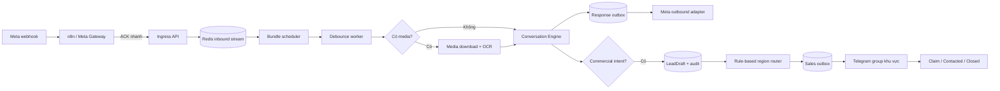

# Master plan cập nhật CFCBot: queue hội thoại, OCR ảnh và Telegram Sales

Ngày cập nhật: 01/10/2026  
Phạm vi: CFC trước, sau đó tái sử dụng có kiểm soát cho ZeO.  
Trạng thái: **Plan hiện hành — cutover runtime đã hoàn thành; queue/OCR/Telegram route chưa triển khai production.**

Tài liệu này thay thế vai trò định hướng của
`PLAN_TRIEN_KHAI_CHATBOT_QUEUE_OCR_TELEGRAM_SALES_2026-09-29.md`.
Bản cũ được giữ lại để đối chiếu lịch sử.

## 1. Kết luận điều hành

### 1.1 CFCBot là hệ thống sở hữu chatbot

- `CFCBot` là source of truth cho API, nghiệp vụ, Redis state, n8n workflow source,
  cấu hình mẫu, test và tài liệu vận hành.
- Javis OS không còn là runtime production của chatbot. `javis.service` đã tắt và
  bị vô hiệu hóa; source cũ chỉ được giữ làm rollback trong giai đoạn quan sát.
- Không xóa source, volume hay dữ liệu Javis/n8n cũ trong ít nhất 7–14 ngày ổn định.

### 1.2 Không bỏ n8n ngay

n8n tiếp tục làm **channel adapter** cho Meta và các SaaS đang dùng credential của n8n.
Business logic mới không được đặt thêm vào n8n.

```text
n8n/Meta gateway -> nhận webhook, xác thực, chuẩn hóa, ACK nhanh
CFCBot API       -> queue, debounce, memory, quyết định, OCR, lead và policy
Redis            -> stream, lease, session, idempotency và lịch xử lý ngắn hạn
Durable store    -> LeadDraft, outbox, audit và trạng thái sale
Workers          -> xử lý bundle, media/OCR, outbound và Telegram
Ollama/Cloud LLM -> suy luận có kiểm soát; không sở hữu rule định tuyến
```

Chỉ cân nhắc bỏ n8n sau khi gateway thay thế chạy shadow tối thiểu 14 ngày,
có quản lý token, retry, rate limit, dead-letter, quan sát và rollback tương đương.

### 1.3 Giữ model hiện tại ở phase đầu

- `qwen2.5:7b-instruct`: hiểu hội thoại và sinh câu trả lời local.
- `bge-m3`: embedding, RAG và đối chiếu OCR với catalog.
- Cloud provider hiện có vẫn là fallback theo cấu hình hiện hành.
- Thêm OCR engine chuyên dụng trước; chưa đổi model hội thoại và chưa đưa vision
  model vào đường production.

## 2. Baseline đã xác minh ngày 01/10/2026

### Đã hoàn thành

- CFCBot chạy độc lập bằng Docker Compose.
- API production giữ port `7777`; n8n giữ `5678`; Redis giữ `6379`.
- `CFCbot start|stop|restart|status|logs` là giao diện lifecycle thống nhất.
- API, Redis, n8n, Ollama và Cloudflare đã qua health check sau cutover.
- Chat smoke test nhận diện đúng intent mua hàng CFC.
- Dữ liệu n8n và Redis cũ được adopt, không bị xóa.
- Test cô lập dùng API `7778` và Redis `6380`, không bật Cloudflare.

### Chưa có hoặc chưa đạt production contract

- Chưa có Redis Stream inbound + debounce bundle bền vững.
- Chưa có response outbox/dead-letter cho Messenger.
- Chưa có media descriptor đầy đủ, media worker hay OCR pipeline.
- Telegram hiện gửi trực tiếp về một destination; chưa route theo vùng, chưa có
  durable sales outbox, claim hoặc SLA.
- Chưa có `LeadDraft` làm bản ghi nghiệp vụ chuẩn.
- n8n-as-code trong repo CFCBot chưa có workspace environment/API key; vì vậy
  chưa được pull, so drift hoặc push workflow live từ repo này.
- Chưa kiểm thử end-to-end bằng tin nhắn khách thật cho Meta, Telegram route và OCR.

## 3. Nguyên tắc kiến trúc không được phá vỡ

1. Webhook phải được xác thực và ghi nhận trước khi chạy AI.
2. Meta retry cùng `message_id` không được tạo thêm reply hoặc lead.
3. Một khách gửi 2–4 tin gần nhau phải tạo một bundle và tối đa một reply phù hợp.
4. Model chỉ trích xuất/đề xuất; rule đã duyệt mới quyết định route sale.
5. Ảnh không phải bằng chứng về hàng thật, giá, tồn kho, chất lượng hay hạn dùng.
6. Telegram/n8n/Ollama lỗi không được làm mất lead đã ghi nhận.
7. Mọi outbound có idempotency key, trạng thái retry và dead-letter.
8. Không ghi secret, token, PII khách hoặc ảnh gốc vào Git/log không kiểm soát.
9. Mỗi capability mới có feature flag, shadow mode, canary và rollback độc lập.
10. CFC chạy trước; chỉ mở cho ZeO sau khi đạt gate CFC.

## 4. Kiến trúc đích



| Thành phần | Sở hữu | Không được sở hữu |
|---|---|---|
| n8n/Meta Gateway | verify webhook, lọc echo, adapter Graph API/SaaS | conversation state, lead rule, OCR policy |
| CFCBot API | validation, policy, conversation/lead contract | chờ AI lâu trong request webhook |
| Redis | stream, debounce state, lease, session, idempotency | bản ghi lead duy nhất không có backup |
| Durable store | LeadDraft, outbox, audit, claim/SLA | cache model hoặc token |
| Model | hiểu ngôn ngữ, tóm tắt, đề xuất candidate | chọn Telegram `chat_id`, xác nhận giá/tồn kho |

Với máy đơn hiện tại, durable store MVP có thể dùng SQLite WAL sau một repository
interface. Trước khi chạy nhiều host/worker hoặc tăng tải, chuyển implementation sang
PostgreSQL mà không đổi domain contract.

## 5. Contract dữ liệu đề xuất

### 5.1 `InboundEvent`

```text
event_id, schema_version, trace_id
brand, page_id, sender_id, message_id
received_at, platform_timestamp
text, input_kind
attachments[]: {type, source_id, ephemeral_url, mime_hint}
location: {lat, lng, title, address}
raw_payload_ref, idempotency_key
```

Raw payload chỉ lưu mã hóa/TTL khi thật sự cần debug. Không đưa raw payload chứa PII
vào log thông thường.

### 5.2 `ConversationBundle`

```text
bundle_id, brand, sender_id
first_received_at, last_received_at, due_at, max_due_at
ordered_event_ids[], combined_text, media_refs[]
status: open|claimed|processing|completed|failed
attempt, lease_owner, lease_until, trace_id
```

### 5.3 `LeadDraft`

```text
lead_id, version, status, source, brand
sender_ref, display_name, customer_phone
commercial_intent, product_candidates, quantity, unit
province, district, sales_region, route_confidence
conversation_summary, ocr_summary, media_ref_ttl
telegram_destination_key, telegram_message_id
created_at, updated_at, claimed_by, claimed_at, sla_due_at
```

### 5.4 `OutboxEvent`

```text
outbox_id, aggregate_type, aggregate_id, aggregate_version
channel, destination_key, payload, idempotency_key
status: pending|sending|sent|retry|dead
attempt, next_attempt_at, last_error_class, sent_at
```

## 6. Gom chuỗi tin nhắn bằng queue/debounce

### Chính sách mặc định

- Quiet window: **4 giây** từ tin mới nhất.
- Max window: **12 giây** từ tin đầu tiên.
- Khóa logic theo `brand + sender_id`.
- Event được sắp theo timestamp rồi `message_id`; không dựa vào thứ tự worker nhận.
- Tin đến sau khi bundle đóng tạo bundle mới.
- Chỉ allowlist lệnh khẩn cấp như stop/human takeover mới được bypass debounce.

Không dùng một node Wait 5 giây cho từng execution n8n: nhiều execution có thể cùng
tỉnh dậy và gửi nhiều reply. Scheduler dùng sorted set để tìm bundle tới hạn; worker
claim bundle bằng lease/compare-and-set.

```text
cfcbot:inbound:v1
cfcbot:bundle:{brand}:{sender_id}
cfcbot:bundle-due:v1
cfcbot:lease:{brand}:{sender_id}
cfcbot:idempotency:inbound:{message_id}
cfcbot:dead-letter:inbound:v1
```

ACK ingress chỉ có nghĩa là event đã được nhận bền, không có nghĩa là bot đã trả lời.

## 7. OCR và hiểu ảnh sản phẩm

### Pipeline

1. Ingress nhận attachment descriptor, không chỉ nhận `attachment_type`.
2. Media worker tải ảnh ngay vì URL Meta có thể hết hạn.
3. Kiểm tra allowlist host, MIME thật, kích thước pixel, dung lượng và số lượng ảnh.
4. Xoay EXIF, resize và tăng tương phản khi cần.
5. OCR trích xuất tên hãng, tên sản phẩm, công thức NPK, quy cách/trọng lượng.
6. Chuẩn hóa text rồi match catalog bằng exact/fuzzy trước, BGE-M3 sau.
7. Conversation Engine nhận candidate + evidence + confidence.
8. Confidence chưa đủ thì hỏi khách xác nhận hoặc gửi ảnh rõ hơn.

### Lựa chọn và policy

- MVP dùng PaddleOCR trong worker riêng, có timeout và giới hạn concurrency.
- Không cài OCR vào request thread của API.
- Chỉ canary vision model sau khi OCR baseline trên bộ ảnh thật chưa đạt.
- Ảnh gốc mặc định TTL 24 giờ; sau đó chỉ giữ hash, metadata và OCR text đã lọc PII.
- Không xác nhận hàng thật/giả hay suy ra giá, tồn kho, chiết khấu, hạn dùng từ ảnh.
- Ảnh khiếu nại/hư hỏng chuyển CSKH/QA, không chuyển nhóm sale thường.

## 8. Lead và Telegram Sales theo khu vực

### Khi tạo lead

Tạo/cập nhật `LeadDraft` khi có commercial intent: hỏi mua, giá, tồn/giao hàng,
sản phẩm + số lượng, nhập sỉ/đại lý, tìm điểm bán để mua, hoặc gửi ảnh và muốn mua
sản phẩm đó. Không bắt buộc phải có SĐT mới tạo draft.

### Route

- Province/district được model hoặc parser trích xuất, nhưng route cuối cùng tra bảng
  cấu hình có version và audit.
- Config chỉ chứa `telegram_destination_key`, không chứa token/chat ID thật.
- Secret store/.env ánh xạ destination key sang chat ID.
- Không rõ khu vực thì vào `TG_SALES_TRIAGE`, đồng thời bot hỏi tỉnh/thành.
- Khách sửa khu vực tạo version mới và update event; không gửi song song âm thầm.

### Delivery và trạng thái

- Request chat chỉ commit LeadDraft + sales outbox.
- Worker gửi Telegram với exponential backoff và jitter.
- Dedup key: `lead:{lead_id}:v:{version}:sales-handoff`.
- Chỉ ghi `routed` sau khi Telegram trả thành công.
- Retry hết ngưỡng chuyển `dead` và tạo operations alert.
- MVP gửi text; inline claim chỉ bật sau khi callback có xác thực và audit.

```text
new -> routed -> claimed -> contacted -> closed
              -> expired/escalated
```

Khi `claimed`, bot dùng human takeover policy: không hứa thêm sale khác và không trả
lời chồng các nội dung mua hàng đang được người thật xử lý.

## 9. Vai trò và tương lai của n8n

### Giai đoạn hiện tại

Giữ ba nhóm workflow mỏng:

1. Meta Ingress: verify, lọc echo, chuẩn hóa, gọi enqueue, ACK.
2. Meta Outbound: gửi message từ outbox và trả delivery result.
3. SaaS/Operations Adapter: Google Sheets/AMIS sync và cảnh báo vận hành.

Telegram sales handoff nên do worker/outbox CFCBot sở hữu. n8n có thể là adapter gửi
giai đoạn đầu, nhưng không được quyết định vùng hoặc chống gửi trùng.

### Gate để sửa workflow live

1. Cấu hình n8n-as-code environment/API key trong repo CFCBot.
2. Chạy `n8nac env status --json` và xác nhận `accessStatus=ready`.
3. List và pull workflow live trước khi sửa.
4. Validate local; push draft trước; test bằng sender riêng.
5. Chỉ publish sau khi canary/rollback đã được duyệt.

### Gate để bỏ n8n

- Gateway mới verify Meta signature/challenge đúng.
- Page token được lưu/rotate an toàn.
- Inbound/outbound có retry, rate limit, dedup và dead-letter.
- Có dashboard/log/alert thay thế khả năng quan sát n8n.
- Shadow 14 ngày và canary đạt SLO.
- Rollback về n8n trong một lệnh hoặc feature flag.

Nếu chưa đủ sáu gate, n8n vẫn ở lại nhưng chỉ đóng vai adapter.

## 10. Chiến lược model

Không switch model chính trong các phase queue/Telegram/OCR đầu tiên:

- Deterministic parser: message ID, phone, quantity, địa danh rõ ràng.
- Qwen: hiểu chuỗi hội thoại/tóm tắt và câu hỏi mơ hồ.
- BGE-M3: RAG và catalog retrieval.
- OCR engine: đọc chữ từ ảnh.
- Vision model tùy chọn: chỉ candidate generation trong shadow/canary.

Mọi model call có timeout, circuit breaker và fallback. Queue không được chờ một model
vô hạn; bundle lỗi retry có giới hạn rồi chuyển dead-letter/human fallback.

## 11. Cấu hình dự kiến trong `.env.example`

Đây là inventory đề xuất, chưa phải yêu cầu bật ngay:

```dotenv
CHAT_QUEUE_ENABLED=false
CHAT_QUEUE_SHADOW=true
CHAT_DEBOUNCE_QUIET_MS=4000
CHAT_DEBOUNCE_MAX_MS=12000
CHAT_WORKER_CONCURRENCY=2
CHAT_MAX_ATTEMPTS=5

MEDIA_INGEST_ENABLED=false
MEDIA_MAX_BYTES=10485760
MEDIA_RETENTION_HOURS=24
OCR_ENABLED=false
OCR_PROVIDER=paddleocr
OCR_WORKER_CONCURRENCY=1

SALES_HANDOFF_ENABLED=false
SALES_HANDOFF_SHADOW=true
SALES_ROUTE_CONFIG_PATH=
TELEGRAM_BOT_TOKEN=
TELEGRAM_SALES_TRIAGE_CHAT_ID=
HUMAN_TAKEOVER_ENABLED=false
```

Không commit giá trị thật. Route file được version hóa chỉ dùng destination key;
chat ID và token luôn ở secret `.env` hoặc secret store.

## 12. Lộ trình triển khai và gate

### Phase 0 — Tách runtime/Cutover: **đã hoàn thành**

- CFCBot tiếp quản API `7777`, Redis, n8n data và lifecycle.
- Javis runtime đã tắt; rollback artifacts còn giữ.

Gate còn lại: quan sát production 7–14 ngày trước khi xóa source/data cũ.

### Phase 1 — Khóa baseline và contract (1–2 ngày)

- Cấu hình read access n8n-as-code, pull snapshot và kiểm tra drift.
- Chốt schema InboundEvent/Bundle/LeadDraft/Outbox.
- Chốt Telegram groups, mapping tỉnh/vùng, SLA và PII policy.
- Ghi baseline duplicate rate, latency, fallback và failure mode.

Gate: contract/versioning được test; chưa có destination mơ hồ.

### Phase 2 — Queue + debounce shadow (2–4 ngày)

- Thêm enqueue endpoint, Redis Stream, scheduler, lease và dead-letter.
- Mirror event vào queue nhưng production reply vẫn đi đường cũ.
- So bundle shadow với hội thoại thật đã ẩn PII.

Gate: không mất/trùng event; 2–4 tin tạo đúng một bundle; restart worker phục hồi được.

### Phase 3 — Response outbox và canary debounce (2–4 ngày)

- Conversation worker xử lý bundle.
- Outbox worker/adapter gửi Meta reply với idempotency.
- Canary theo Page + stable sender bucket: 5% -> 20% -> 50% -> 100%.

Gate: duplicate reply < 0,1%; P95 từ tin cuối tới reply trong 4–10 giây.

### Phase 4 — LeadDraft + Telegram Sales (2–4 ngày)

- Durable LeadDraft, route table, sales outbox, retry/dead-letter.
- Chạy shadow/dry-run trước, không gửi group sale thật.
- Canary group trung tâm rồi mới mở từng vùng.

Gate: mỗi lead/version gửi đúng một lần, route đúng >= 98%, Telegram lỗi không mất lead.

### Phase 5 — Media/OCR (3–6 ngày)

- Mở rộng Meta attachment contract và secure media downloader.
- PaddleOCR worker, catalog matching và confirmation flow.
- Shadow trên bộ ảnh đã duyệt; CFC canary trước.

Gate: precision đạt ngưỡng được chốt; không bịa giá/tồn/hàng thật giả.

### Phase 6 — Claim, SLA và human takeover (2–4 ngày)

- Telegram callback/dashboard claim có xác thực.
- Reminder/escalation theo SLA.
- Bot/sale mutual exclusion và audit đầy đủ.

Gate: không có bot và sale trả lời chồng; mọi action truy được người/thời điểm.

### Phase 7 — Đánh giá giảm/bỏ n8n (sau ít nhất 14 ngày ổn định)

- Đo chi phí vận hành và lỗi thực tế của adapter n8n.
- Nếu n8n ổn và mỏng, có thể giữ lâu dài.
- Chỉ xây Meta Gateway riêng nếu lợi ích rõ hơn chi phí sở hữu.

## 13. Bộ test bắt buộc

1. Bốn text trong 4 giây tạo một bundle/reply đủ sản phẩm, số lượng và khu vực.
2. Text + ảnh + location + SĐT đến lệch thứ tự vẫn được sắp đúng.
3. Tin đến sau max window tạo bundle mới.
4. Meta retry cùng message ID không xử lý/reply/handoff lặp.
5. Hai worker cùng thấy một sender chỉ một worker finalize.
6. Restart API/worker/Redis/n8n giữa chừng không mất event/lead.
7. Ollama timeout không khóa sender vô hạn.
8. Outbound Meta timeout/429 retry đúng, không gửi đôi.
9. Ảnh mờ hỏi lại; OCR không khớp catalog không bịa SKU.
10. Ảnh khiếu nại đi CSKH/QA, không vào group sale.
11. Có khu vực đi đúng group; thiếu khu vực đi triage.
12. Khách đổi khu vực tạo route update có audit.
13. Telegram timeout/429 retry; hết retry vào dead-letter và alert.
14. Không có SĐT nhưng có ý định mua vẫn tạo LeadDraft.
15. Sale claim thì bot ngừng luồng mua hàng liên quan.
16. Feature flag off trả hệ thống về hành vi cũ không mất dữ liệu.
17. Log, test artifact và alert không lộ token/PII ngoài policy.

## 14. SLO và chỉ số nghiệm thu

- Inbound accepted/enqueued >= 99,9%.
- Duplicate customer reply < 0,1%.
- Duplicate Telegram lead = 0 trong test/canary.
- P95 từ tin cuối đến reply: 4–10 giây với quiet window 4 giây.
- Lead route đúng vùng >= 98%; không chắc thì đi triage, không đoán.
- Outbox delivery success/retry/dead đều quan sát được.
- Không regression order, loyalty, agronomy, product và dealer route hiện hữu.
- OCR ưu tiên precision; ngưỡng cụ thể chỉ chốt sau khi có bộ ảnh thật.

## 15. Rollout và rollback

Mỗi capability có flag riêng: queue, debounce reply, OCR, sales handoff và takeover.
Rollback không được yêu cầu tắt toàn bộ CFCBot.

1. Tắt capability flag gây lỗi.
2. Giữ event/outbox chưa xử lý để replay sau.
3. Trả reply về đường đồng bộ hiện tại.
4. Nếu runtime CFCBot lỗi nghiêm trọng, dùng artifacts Javis/zeo theo runbook.

Không xóa stream, outbox, DB hoặc volume trong lúc incident.

## 16. Quyết định cần chủ hệ thống chốt

1. Danh sách group Telegram thật và mapping tỉnh/huyện của từng group.
2. Group triage mặc định và người chịu trách nhiệm.
3. SLA nhận lead/liên hệ khách; ai nhận escalation.
4. Telegram được nhận tên, SĐT, sender ID, ảnh gốc hay chỉ tóm tắt/OCR.
5. Ảnh giữ 24 giờ, 7 ngày hay xóa ngay sau OCR.
6. Sale claim trong Telegram hay dashboard CFCBot.
7. Khi sale claim, bot im hoàn toàn hay vẫn trả FAQ không liên quan.
8. Lưu lượng trung bình/cao điểm và số Page dự kiến.
9. Chấp thuận SQLite WAL cho single-host MVP hay yêu cầu PostgreSQL ngay.
10. CFC chạy đủ canary trước rồi mới mở ZeO hay cần song song.

Nếu chưa chốt, mặc định dùng triage, không gửi ảnh gốc, retention 24 giờ, SQLite WAL
single-host, CFC trước ZeO và không gửi vào group sale thật.

## 17. Definition of Done toàn chương trình

- Khách gửi chuỗi tin/ảnh nhận một phản hồi đúng ngữ cảnh.
- Tin và lead không mất khi một dependency restart/tạm lỗi.
- Ảnh chỉ tạo candidate có evidence, không vượt policy.
- Lead thương mại đi đúng nhóm vùng, có dedup, SLA, claim và audit.
- Có metric cho queue lag, bundle, OCR, outbox và sales SLA.
- Mọi phase có test, shadow/canary evidence và rollback đã diễn tập.
- Source, workflow và tài liệu trong CFCBot là nguồn duy nhất; Javis retire an toàn.

## 18. Sprint tiếp theo được khuyến nghị

Chỉ làm Phase 1, chưa sửa production workflow:

1. Thu thập câu trả lời mục 16.
2. Tạo n8n API key và cấu hình n8n-as-code environment cho repo CFCBot.
3. Pull/read-only compare bảy workflow với source local.
4. Khóa schema/version cho InboundEvent, Bundle, LeadDraft và Outbox.
5. Viết test contract + failure simulation trước khi thêm worker.
6. Thiết kế route config mẫu chỉ bằng destination key, chưa điền secret thật.

Sau khi review kết quả Phase 1 mới duyệt implementation Phase 2.

## 19. Ngoài phạm vi hiện tại

- Không đổi model production chỉ để làm queue/OCR.
- Không bật CRM write hoặc tự tạo Sale Order AMIS.
- Không gửi test vào group sale thật khi chưa duyệt.
- Không xóa Javis/source/volume cũ trong observation window.
- Không push/publish workflow live khi n8n-as-code chưa configured và chưa pull.
- Không xây Meta Gateway riêng trong cùng đợt với queue/OCR/Telegram.
