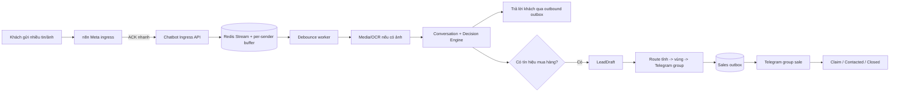

# Plan chuẩn bị triển khai Chatbot độc lập, hàng đợi hội thoại, OCR và Telegram Sales

> **Đã được thay thế ngày 01/10/2026.** Xem [Master plan cập nhật CFCBot: queue, OCR và Telegram Sales](PLAN_DINH_HUONG_CAP_NHAT_CFCBOT_QUEUE_OCR_TELEGRAM_2026-10-01.md). Tài liệu này được giữ để đối chiếu lịch sử trước cutover.

Ngày lập: 29/09/2026  
Phạm vi: CFC trước, sau đó tái sử dụng cho ZeO.  
Trạng thái: **Đề xuất để duyệt — chưa triển khai, chưa thay đổi production.**

## 1. Kết luận kiến trúc

### 1.1 Có nên tách `chatbot/` khỏi Javis OS?

**Nên tách về runtime và trách nhiệm, chưa nên tách Git repository ngay.**

- Chatbot trở thành một service độc lập, có lifecycle, health check, cấu hình và log riêng.
- Javis OS không còn phải import trực tiếp `chatbot/server` để chatbot chạy được.
- Trong giai đoạn chuyển tiếp, vẫn giữ cùng monorepo để refactor an toàn và dùng lại test/dữ liệu.
- Chỉ cân nhắc tách repository sau khi chatbot có API contract ổn định, pipeline deploy riêng và không còn import chéo.

Mục tiêu cuối:

```text
Javis OS       -> trợ lý cá nhân/quản trị
Chatbot API    -> Messenger, khách hàng, sales, OCR, CRM handoff
n8n            -> adapter nhận/gửi kênh và tích hợp SaaS
Redis          -> queue, debounce, session, idempotency, outbox
Ollama         -> text planning/generation và embedding hiện tại
```

### 1.2 Có nên bỏ n8n ngay?

**Không nên bỏ ngay.** n8n hiện đang giữ webhook Meta, credential Page và gửi reply. Thay nó ngay lúc thêm queue/OCR/handoff sẽ làm tăng rủi ro quá lớn.

Hướng đúng là thu nhỏ n8n:

- n8n chỉ nhận webhook, chuẩn hóa tối thiểu, gọi API enqueue và gửi outbound message.
- Business logic, memory, debounce, OCR, phân tuyến sale và idempotent outbox nằm trong Chatbot API/Redis.
- Sau khi hệ thống mới chạy ổn, có thể thay n8n bằng một Meta Gateway nhỏ nếu chi phí vận hành n8n không còn hợp lý.

Điều kiện mới được bỏ n8n:

1. Meta webhook verification và signature validation đã có ở gateway mới.
2. Có refresh/quản lý Page token an toàn.
3. Có retry, rate limit, dead-letter queue và idempotency cho cả inbound/outbound.
4. Chạy shadow ít nhất 14 ngày và kết quả tương đương workflow hiện tại.
5. Có rollback về n8n trong một thao tác.

## 2. Hiện trạng đã đối chiếu từ source

- Workflow CFC/ZeO hiện xử lý đồng bộ: Meta Trigger → lọc input → gọi `/api/chat-pipeline` → gửi reply.
- Pipeline đã có message idempotency, sender lease, session/GoalFrame và Redis.
- Workflow CFC nhận biết location và biết có attachment, nhưng chưa truyền URL/ID ảnh vào API.
- `ChatPipelineRequest` mới có `input_kind` và `attachment_type`; chưa có media descriptor.
- `telegram_notifier.py` đang dùng một `chat_id` chung và gửi lead trực tiếp khi nhận được số điện thoại.
- Thông báo Telegram hiện chưa có route theo khu vực, durable outbox, trạng thái nhận lead hoặc SLA.
- `Chatbot Operations Alert` đã có Redis dedup cho cảnh báo vận hành; có thể học lại pattern nhưng không dùng chung event nghiệp vụ sale.
- Chưa thấy OCR/vision pipeline dành cho ảnh Messenger trong chatbot.

## 3. Luồng đích



Các nguyên tắc bắt buộc:

- Webhook được nhận và lưu bền trước khi xử lý AI.
- Một chuỗi tin nhắn gần nhau tạo tối đa một câu trả lời phù hợp ngữ cảnh.
- Không mất lead khi Telegram/n8n/Ollama tạm lỗi.
- Không gửi trùng lead khi Meta retry webhook.
- Không để model tự chọn nhóm Telegram hoặc tự tạo `chat_id`.
- Không tự báo giá, tồn kho, chiết khấu hay xác thực sản phẩm chỉ dựa trên ảnh.

## 4. Gom 2–4 tin nhắn liên tục của cùng khách

### 4.1 Không dùng Wait 5 giây đơn giản trong từng execution n8n

Wait riêng lẻ dễ tạo nhiều execution cùng tỉnh dậy và vẫn trả lời nhiều lần. Debounce phải có state dùng chung trong Redis.

### 4.2 Chính sách đề xuất

- Quiet window mặc định: **4 giây** kể từ tin cuối cùng.
- Max window: **12 giây** kể từ tin đầu tiên để khách không phải chờ vô hạn.
- Mỗi tin mới cùng `brand + sender_id` cập nhật `due_at` nhưng không vượt quá `max_due_at`.
- Giữ đúng thứ tự theo timestamp/message ID; text, ảnh và location đều nằm trong cùng bundle.
- Chỉ một worker được claim bundle bằng distributed lease.
- Sau khi bundle đã đóng, tin đến sau tạo bundle kế tiếp.
- Các lệnh cần phản hồi tức thì như reset/stop-human-takeover có thể bypass debounce bằng allowlist cố định.

Ví dụ:

```text
0s  "Tôi cần mua phân"
1s  "NPK 20-20-15"
3s  "10 bao"
4s  "ở Ô Môn"
8s  Hết 4 giây im lặng -> xử lý một lần, trả lời một lần
```

### 4.3 Redis contract đề xuất

- `chat:inbound` — Redis Stream lưu mọi inbound event.
- `chat:bundle:{brand}:{sender_id}` — danh sách event đang gom.
- `chat:bundle-due` — sorted set chứa thời điểm bundle đủ điều kiện xử lý.
- `chat:lease:{brand}:{sender_id}` — khóa worker theo khách.
- `chat:response-outbox` — reply chưa gửi hoặc đang retry.
- `chat:dead-letter` — event vượt retry, không được xóa âm thầm.

Payload phải có `event_id`, `message_id`, `sender_id`, `brand`, `received_at`, `text`, media descriptors và trace ID. Redis chỉ là transport/state nhanh; lead quan trọng cần có bản ghi bền hoặc snapshot định kỳ.

## 5. Xử lý ảnh và OCR bao phân bón

### 5.1 Pipeline ảnh

1. n8n lấy attachment ID/URL/type từ webhook Meta và gửi descriptor vào Ingress API.
2. Media worker tải ảnh ngay vì URL Meta có thể hết hạn.
3. Kiểm tra domain allowlist, MIME thực, kích thước, dung lượng và giới hạn số ảnh.
4. Chuẩn hóa ảnh: xoay EXIF, resize, tăng tương phản khi cần.
5. OCR lấy tên hãng, tên sản phẩm, công thức NPK, trọng lượng/quy cách và chữ nổi bật.
6. Chuẩn hóa OCR text rồi đối chiếu public product catalog bằng exact/fuzzy + BGE-M3.
7. Trả danh sách candidate kèm confidence/evidence cho Conversation Engine.
8. Chỉ xác nhận sản phẩm sau khi khách đồng ý nếu confidence chưa đủ cao.

### 5.2 Model đề xuất

Giai đoạn đầu **giữ nguyên model hiện tại**:

- `qwen2.5:7b-instruct`: hiểu hội thoại và lập quyết định text.
- `bge-m3`: embedding OCR text/catalog.
- Thêm OCR engine chuyên dụng như PaddleOCR; OCR không phải nhiệm vụ tốt nhất của text-only Qwen hiện tại.

Giai đoạn sau mới canary một vision model riêng nếu OCR + catalog match chưa đạt mục tiêu. Vision model chỉ đề xuất candidate, không phải nguồn sự thật. Không cần switch model chính chỉ để nhận ảnh.

### 5.3 Policy an toàn

- Ảnh chỉ giúp nhận diện candidate; không kết luận hàng thật/giả nếu chưa có quy trình nghiệp vụ.
- Không suy ra giá, tồn kho, hạn sử dụng hoặc chất lượng từ ảnh.
- Confidence cao: hỏi xác nhận ngắn trước khi đi tiếp.
- Confidence trung bình/thấp: yêu cầu ảnh mặt trước rõ hơn hoặc tên sản phẩm.
- Ảnh lỗi/nguy hiểm/khiếu nại phải vào nhóm CSKH/QA, không vào nhóm sale thường.
- Ảnh gốc có TTL; log/evaluation mặc định chỉ giữ hash và kết quả đã che PII.

## 6. LeadDraft và phân tuyến Telegram cho sale khu vực

### 6.1 Khi nào coi là “khách hỏi hàng”?

Tạo hoặc cập nhật `LeadDraft` khi có ít nhất một tín hiệu thương mại:

- hỏi mua, hỏi giá, hỏi còn hàng/giao hàng;
- nêu sản phẩm + số lượng;
- muốn nhập sỉ/làm đại lý;
- hỏi điểm bán với ý định mua;
- gửi ảnh sản phẩm và hỏi mua loại đó.

Không tạo sales lead cho chào hỏi, FAQ kỹ thuật thuần túy hoặc câu không đủ ý nghĩa. Khiếu nại đi route CSKH/QA riêng.

### 6.2 Dữ liệu LeadDraft

- `lead_id`, `draft_version`, `status`, `created_at`, `updated_at`;
- brand, Page, sender ID và tên hiển thị;
- SĐT nếu khách tự cung cấp;
- tỉnh/huyện/khu vực và confidence chuẩn hóa;
- sản phẩm/candidate, quy cách, số lượng, đơn vị, cây trồng/mục đích;
- OCR summary và media reference có TTL;
- tóm tắt hội thoại liên quan, không gửi toàn bộ lịch sử;
- route đã chọn, Telegram message ID, trạng thái delivery/claim;
- idempotency key và audit trail.

### 6.3 Route khu vực

Tạo bảng cấu hình được duyệt, ví dụ:

```text
Tỉnh/thành -> sales_region -> telegram_destination_key -> owner/SLA
Cần Thơ   -> mien_tay_1   -> TG_SALES_MIEN_TAY_1       -> 5 phút
Hậu Giang -> mien_tay_1   -> TG_SALES_MIEN_TAY_1       -> 5 phút
...
unknown   -> central      -> TG_SALES_TRIAGE           -> 3 phút
```

- Map tỉnh → vùng nằm trong config nghiệp vụ có version và audit.
- Bot token/chat ID thật nằm trong secret store, không commit vào Git.
- Nếu chưa biết khu vực: bot hỏi tỉnh/thành, đồng thời có thể gửi lead mức `needs_area` vào nhóm điều phối trung tâm.
- Nếu khách sửa khu vực sau khi đã route: tạo event cập nhật; không âm thầm để hai nhóm cùng xử lý.
- Route luôn do rule đã duyệt quyết định; model chỉ trích xuất địa danh và confidence.

### 6.4 Nội dung Telegram đề xuất

```text
🟢 LEAD MUA HÀNG CFC — #CFC-20260929-0012
Khách: Nguyễn Văn A
Khu vực: Ô Môn, Cần Thơ
Nhu cầu: NPK 20-20-15, khoảng 10 bao
SĐT: 09xx...
Nguồn: Messenger CFC
Ảnh: đã OCR, candidate ... (confidence ...)
Nhận lúc: ... | SLA: liên hệ trước ...
[Nhận lead] [Đã liên hệ] [Không phù hợp]
```

MVP có thể gửi text trước. Inline button/claim chỉ mở sau khi có Telegram callback endpoint, chữ ký, phân quyền và audit.

### 6.5 Delivery bảo đảm

- Chat transaction chỉ ghi `LeadDraft` + `sales_outbox`; không gọi Telegram trực tiếp trong request.
- Worker gửi Telegram và retry exponential backoff.
- Dedup key: `lead:{lead_id}:version:{version}:sales-handoff`.
- Telegram lỗi không làm mất lead và không khiến chatbot nói sai rằng sale đã nhận.
- Khi gửi thành công mới ghi `telegram_message_id` và trạng thái `routed`.
- Dead-letter phải tạo operations alert cho quản trị.

## 7. Vai trò của n8n trong kiến trúc mới

Tạm giữ ba workflow riêng:

1. **Meta Ingress**: verify webhook, lọc echo, chuẩn hóa payload, enqueue và trả ACK nhanh.
2. **Meta Outbound**: nhận outbox event, gửi reply qua Graph API, ghi delivery result.
3. **Operations Alert**: cảnh báo lỗi queue/OCR/outbox; không kiêm sales handoff.

Sales handoff có thể được gửi bằng worker Python trực tiếp hoặc một workflow con n8n. Khuyến nghị production là worker/outbox trong Chatbot API để logic exactly-once và route không phụ thuộc execution UI; n8n chỉ là adapter nếu cần thay credential dễ dàng.

## 8. Lộ trình triển khai

### Phase 0 — Chốt nghiệp vụ và baseline (0,5–1 ngày)

- Chốt danh sách nhóm Telegram và mapping tỉnh/vùng.
- Chốt điều kiện tạo lead, dữ liệu được gửi, SLA và retention ảnh.
- Backup n8n/Redis/settings; ghi baseline latency, duplicate và fallback.
- Bổ sung n8n API key cho n8n-as-code trước khi sửa/push workflow.

Gate: các câu hỏi ở mục 11 đã được trả lời; không còn destination mơ hồ.

### Phase 1 — Tách runtime Chatbot khỏi Javis (1–3 ngày)

- Tạo service `chatbot-api` riêng và health check.
- Giữ `/api/chat-pipeline` contract tương thích.
- Javis giữ compatibility proxy trong canary, không import chéo lâu dài.
- systemd/Docker, log và restart policy riêng.

Gate: cùng payload cho response tương đương; tắt Javis không làm chatbot chết.

### Phase 2 — Ingress queue và debounce (2–4 ngày)

- Thêm Ingress API chỉ validate/enqueue/ACK.
- Redis Stream, per-sender bundle, quiet/max window, lease và dead-letter.
- Outbound response outbox; n8n không chờ AI trong webhook request.
- Feature flag theo Page và stable sender bucket.

Gate: 2–4 tin liên tục tạo đúng một response; restart worker không mất tin.

### Phase 3 — LeadDraft + Telegram route theo khu vực (2–4 ngày)

- Tách sales signal khỏi việc chỉ nhìn thấy SĐT.
- Implement LeadDraft, route table, sales outbox và dedup.
- Nhóm trung tâm cho lead chưa rõ khu vực.
- Telegram message có lead ID, SLA và dữ liệu tối thiểu cần thiết.

Gate: mỗi lead/version gửi đúng một lần, đúng nhóm; Telegram lỗi vẫn retry được.

### Phase 4 — Media ingest + OCR (3–6 ngày)

- Mở rộng Meta payload/media contract.
- Download an toàn, TTL storage, OCR, catalog match và confirmation flow.
- Ảnh được gom cùng text trong cùng debounce bundle.
- Canary CFC trước, ZeO sau.

Gate: bộ ảnh thật đã duyệt đạt precision mục tiêu; không bịa giá/tồn/hàng thật giả.

### Phase 5 — Sale claim và human takeover (2–4 ngày)

- Trạng thái `new/routed/claimed/contacted/closed`.
- Callback Telegram hoặc dashboard để nhận lead.
- Khi sale takeover, bot im hoặc chỉ trả câu đã duyệt.
- SLA reminder/escalation và audit.

Gate: không có bot/sale trả lời chồng nhau; mọi action truy được người và thời điểm.

### Phase 6 — Canary và production rollout (2–3 ngày + theo dõi)

- Shadow queue/OCR trước; không gửi khách/Telegram.
- Canary 5% → 20% → 50% → 100% theo sender bucket.
- Rollback độc lập cho debounce, OCR, sales route và runtime split.
- Theo dõi ít nhất 7–14 ngày trước khi cân nhắc bỏ compatibility proxy hoặc n8n.

## 9. Test bắt buộc

1. Bốn text trong 4 giây → một response chứa đủ product/quantity/area.
2. Text + ảnh + SĐT đến khác thứ tự → một bundle đúng thứ tự.
3. Tin thứ năm đến quá max window → tạo bundle mới, không giữ khách vô hạn.
4. Meta retry cùng message ID → không xử lý/gửi Telegram lặp.
5. Hai worker cùng thấy một sender → chỉ một worker finalize.
6. Restart Chatbot/Ollama/n8n giữa chừng → event và lead còn nguyên.
7. Ảnh mờ/sai sản phẩm → hỏi lại, không tự khẳng định.
8. OCR đúng chữ nhưng catalog không có → không bịa SKU.
9. Có khu vực → đúng Telegram group; thiếu khu vực → group trung tâm.
10. Khách đổi từ Cần Thơ sang Đồng Tháp → route update có audit, không xử lý đôi.
11. Telegram timeout/429 → retry, không mất lead.
12. Khiếu nại có ảnh → CSKH/QA, không đi nhóm sale thường.
13. Sale đã claim → bot không tiếp tục hứa một sale khác sẽ liên hệ.
14. Không có SĐT nhưng có ý định mua → vẫn có LeadDraft; bot hỏi contact phù hợp.
15. PII không xuất hiện trong log/evaluation ngoài policy đã duyệt.

## 10. Chỉ số nghiệm thu

- Inbound accepted/enqueued: ≥ 99,9%.
- Duplicate customer reply: < 0,1%.
- Duplicate Telegram lead: 0 trong bộ test và canary.
- P95 từ tin cuối đến reply: mục tiêu 4–10 giây với quiet window 4 giây.
- Lead route đúng vùng: ≥ 98%; phần không chắc đi `central`, không đoán.
- OCR product candidate precision: đặt ngưỡng sau khi có bộ ảnh thật; ưu tiên precision hơn recall.
- Tỷ lệ lead Telegram delivered, claimed đúng SLA và dead-letter đều quan sát được.
- Không regression các route order/loyalty/agronomy/product/dealer hiện hữu.

## 11. Câu hỏi cần chủ hệ thống chốt để đạt khoảng 95% yêu cầu

1. Có những nhóm Telegram sale nào, mỗi nhóm phụ trách tỉnh/huyện nào? Nhóm mặc định là nhóm nào?
2. “Khách hỏi hàng” gồm mọi câu hỏi sản phẩm, hay chỉ khi có ý định mua/giá/số lượng/giao hàng?
3. Có gửi lead khi chưa có SĐT không? Sale sẽ liên hệ bằng Messenger hay bắt buộc bot xin SĐT trước?
4. Telegram được phép nhận những trường nào: tên, SĐT đầy đủ, sender ID, ảnh gốc hay chỉ tóm tắt/OCR?
5. SLA sale nhận lead là bao lâu? Ai nhận cảnh báo nếu quá SLA?
6. Sale claim/đóng lead ngay trong Telegram hay qua dashboard Javis/Chatbot?
7. Khi sale claim, chatbot phải im hoàn toàn hay vẫn được trả FAQ không liên quan?
8. Ảnh khách được lưu bao lâu: 24 giờ, 7 ngày hay không lưu sau OCR?
9. Trung bình và cao điểm có bao nhiêu tin/phút, bao nhiêu Page sẽ dùng chung hệ thống?
10. Có đồng ý giữ n8n làm Meta adapter trong giai đoạn đầu không?
11. Server hiện có GPU/RAM bao nhiêu để quyết định có canary vision model hay chỉ dùng OCR?
12. CFC triển khai trước rồi ZeO, hay hai thương hiệu phải chạy đồng thời?

## 12. Quyết định mặc định nếu chưa có câu trả lời

- Giữ chung monorepo, tách thành service độc lập.
- Giữ n8n làm Meta adapter.
- Debounce 4 giây, max wait 12 giây.
- Giữ Qwen 2.5 7B + BGE-M3; thêm OCR chuyên dụng, chưa thêm vision model.
- Tạo LeadDraft cho commercial intent; chưa có khu vực thì vào nhóm central.
- Không cần SĐT để tạo draft, nhưng bot tiếp tục xin SĐT/kênh liên hệ.
- Telegram chỉ nhận dữ liệu tối thiểu; ảnh gốc không gửi mặc định.
- Chưa ghi AMIS và chưa tự tạo Sale Order trong đợt này.

## 13. Việc chưa được phép làm ở giai đoạn plan

- Không sửa/push workflow production.
- Không tạo/xóa Telegram group hoặc đổi credential.
- Không đổi model đang phục vụ khách.
- Không bật CRM write.
- Không tách repository hoặc xóa compatibility route.
- Không gửi thử vào nhóm sale thật khi chưa có destination và người duyệt.
