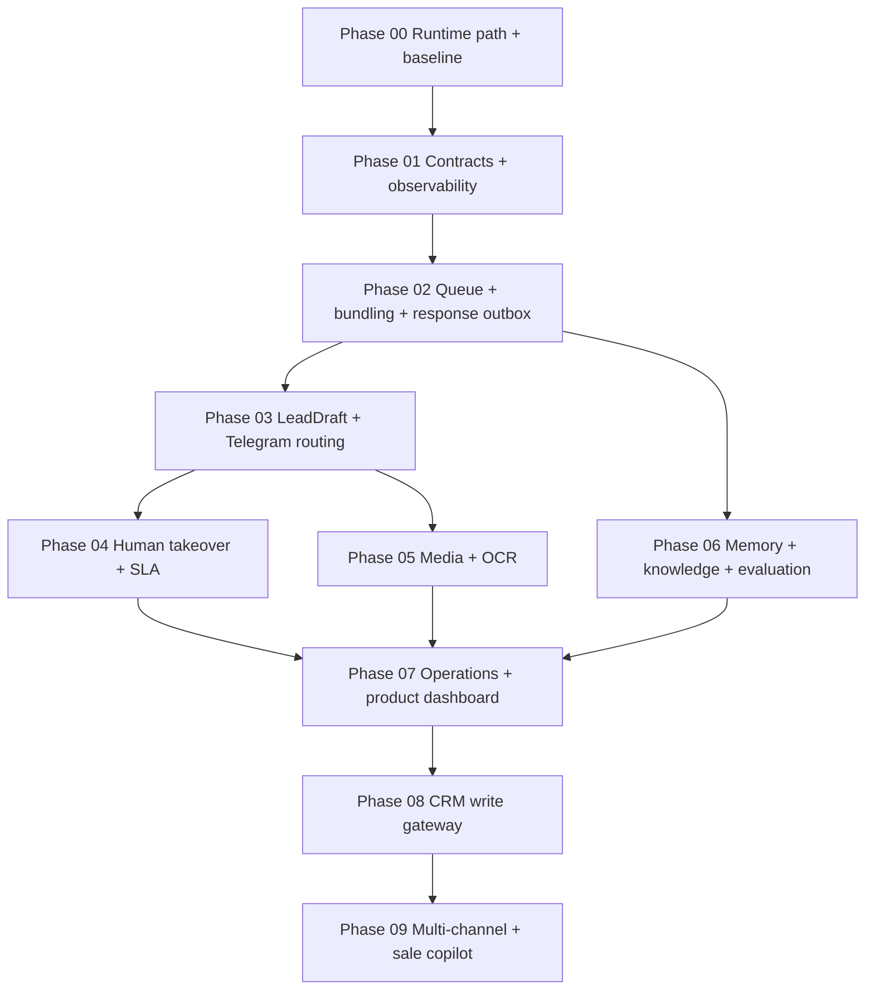

# CFCBot Feature Upgrade — Phase Execution Pack

Ngày rà soát: 06/10/2026  
Nguồn: `PLAN_NANG_CAP_TINH_NANG_CFCBOT_2026-10-01.md` + source hiện hành.  
Mục đích: biến roadmap tổng quát thành các phase có thể triển khai, kiểm thử,
nghiệm thu và rollback độc lập.

## Hiện trạng quan trọng

- Repo đã chuyển từ `/home/kali/Works/David-nguyen/CFCBot` sang
  `/home/kali/Works/CFC/CFCBot`.
- Container production, bind mount và command `CFCbot` đã được rebind sang repo mới.
- API đã có idempotency theo `message_id`, sender lease, conversation memory và
  takeover state `pending/human/closed`.
- Redis Stream, debounce bundle, response/sales outbox và LeadDraft theo vùng đã
  triển khai shadow; OCR vẫn thuộc Phase 05.
- Telegram hiện gửi trực tiếp tới một `chat_id` chung.
- Bảy workflow n8n source vẫn hiện diện trong `workflows/local-n8n`.
- CodeGraph index có mặt nhưng không mở được database sau khi repo bị move; cần
  re-index trong Phase 00/01.

## Thứ tự triển khai bắt buộc



| Phase | File | Trạng thái ban đầu | Ước lượng |
|---|---|---|---|
| 00 | [Runtime path và baseline](PHASE_00_RUNTIME_PATH_AND_BASELINE.md) | DONE | 0,5–1 ngày |
| 01 | [Contracts và observability](PHASE_01_EVENT_CONTRACTS_AND_OBSERVABILITY.md) | SHADOW / n8n BLOCKED | 2–4 ngày |
| 02 | [Queue, bundling và response outbox](PHASE_02_QUEUE_BUNDLING_RESPONSE_OUTBOX.md) | SHADOW VALIDATED | 3–5 ngày |
| 03 | [LeadDraft và Telegram routing](PHASE_03_LEAD_TELEGRAM_ROUTING.md) | SHADOW / SETUP PENDING | 3–5 ngày |
| 04 | [Human takeover và SLA](PHASE_04_HUMAN_TAKEOVER_AND_SLA.md) | PENDING | 2–4 ngày |
| 05 | [Media ingest và OCR](PHASE_05_MEDIA_OCR.md) | PENDING | 4–7 ngày |
| 06 | [Memory, knowledge và evaluation](PHASE_06_MEMORY_KNOWLEDGE_EVALUATION.md) | PENDING | 5–10 ngày |
| 07 | [Dashboard vận hành và kinh doanh](PHASE_07_OPERATIONS_PRODUCT_DASHBOARD.md) | PENDING | 4–7 ngày |
| 08 | [CRM write gateway](PHASE_08_CRM_WRITE_GATEWAY.md) | PENDING | 4–8 ngày |
| 09 | [Multi-channel và sale copilot](PHASE_09_MULTICHANNEL_SALES_COPILOT.md) | LAST | 7–14 ngày |

Ước lượng là thời gian kỹ thuật sau khi dependency và quyết định nghiệp vụ đã sẵn
sàng; không cộng thời gian chờ owner, dữ liệu mẫu hoặc credential.

## Quy tắc thực thi

1. Chỉ một phase ở trạng thái `IN_PROGRESS` tại một thời điểm, trừ các task tài
   liệu/test không đụng cùng runtime.
2. Không mở phase sau khi exit gate của dependency chưa đạt.
3. Mọi feature mới mặc định `off`, sau đó `shadow`, `canary`, rồi mới `on`.
4. Không sửa/publish workflow live nếu chưa cấu hình n8n-as-code, list và pull bản live.
5. Không gửi Telegram group thật, ghi CRM thật hoặc trả khách thật trong dry-run.
6. Mỗi phase phải có evidence: test output, metric baseline, canary report và rollback log.
7. Không đưa secret, PII, raw media hoặc file `.env*` vào tài liệu/commit.

## Trạng thái chuẩn

```text
PENDING -> READY -> IN_PROGRESS -> SHADOW -> CANARY -> DONE
                         \-> BLOCKED
                         \-> ROLLED_BACK
```

Khi cập nhật trạng thái, ghi ngày, owner, commit SHA, feature flags và link evidence
ngay trong file phase tương ứng.

## Gate chung trước production

- Unit/contract test pass.
- Failure simulation pass.
- Không có secret/PII trong log hoặc artifact.
- Feature flag off phục hồi hành vi cũ.
- Shadow evidence đủ đại diện.
- Canary có owner theo dõi và ngưỡng dừng rõ ràng.
- Rollback đã chạy thử, không chỉ tồn tại trên giấy.

## Quyết định thứ tự

- **Làm đầu tiên:** Phase 00 vì đường dẫn runtime hiện không còn khớp source.
- **Giá trị kinh doanh sớm nhất:** Phase 02 rồi Phase 03; chúng giải quyết reply
  trùng/ngắt ngữ cảnh và bỏ sót lead.
- **OCR không làm trước queue:** ảnh cũng phải đi qua event ordering, bundle và retry.
- **CRM write làm gần cuối:** chỉ an toàn sau khi lead, audit, idempotency và dashboard ổn định.
- **Multi-channel/sale copilot làm cuối:** tránh nhân rộng một pipeline chưa ổn định.

## Tài liệu liên quan

- [Roadmap sản phẩm gốc](../../PLAN_NANG_CAP_TINH_NANG_CFCBOT_2026-10-01.md)
- [Master plan kỹ thuật](../../chatbot/plan/PLAN_DINH_HUONG_CAP_NHAT_CFCBOT_QUEUE_OCR_TELEGRAM_2026-10-01.md)
- [Plan migration](../../PLAN_DI_CHUYEN_CHATBOT_TU_JAVIS_OS_2026-09-30.md)
- [Test report migration](../../docs/operations/TEST_REPORT_2026-09-30.md)
